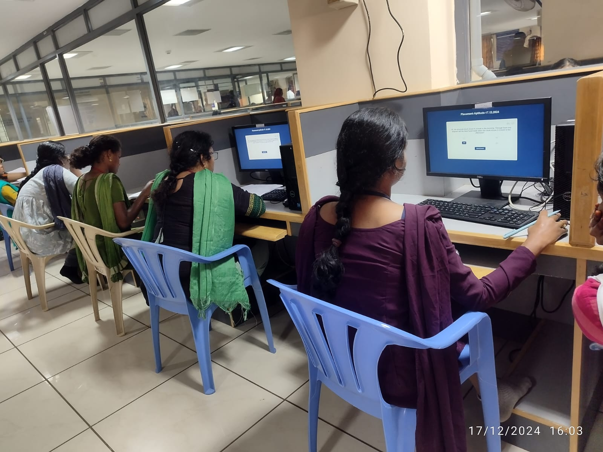
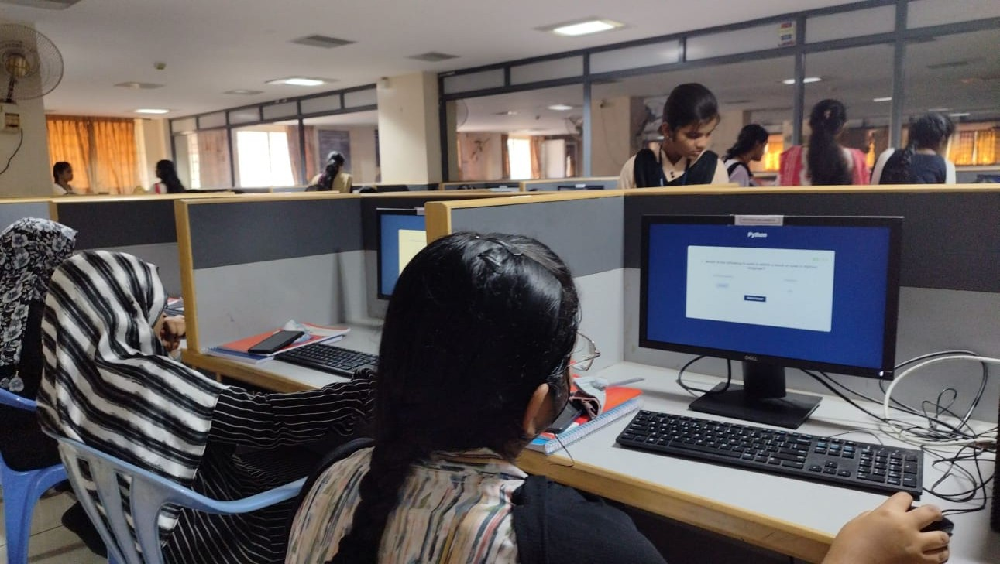
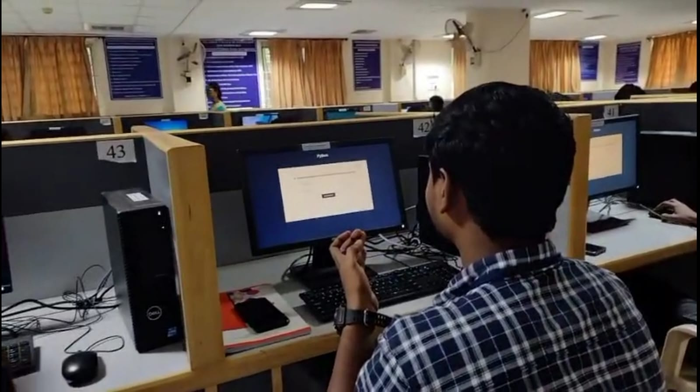

# 🧠 BrainBite - Secure Quiz Management Platform

**BrainBite** is a full-stack web-based quiz application built using PHP and MySQL. Designed for departmental and academic assessments, it ensures fairness through full-screen enforcement and session control, with a robust admin dashboard for managing quizzes, tracking scores, and exporting results.

---

  
  
  

## 🚀 Features

### 👨‍🎓 Student Side
- Login using registration number
- Access to **one active quiz at a time**
- **Randomized question order** per student
- **Timer-based** quiz system with auto-submit
- **Full-screen mode enforcement** to prevent cheating
- **Tab-switch or full-screen exit immediately ends the quiz**
- Results with score and answer review (available after quiz ends)

### 🛠️ Admin Side
- Create, activate, and deactivate quizzes
- Add/edit/delete:
  - Multiple Choice Questions (MCQs)
  - Fill-in-the-Blanks (supports multiple correct answers)
- Bulk upload questions via Excel/CSV using PhpSpreadsheet
- Export questions and results in Excel format
- View student scores and responses
- Reset quiz attempts or delete quizzes as needed

---

## 📦 Tech Stack

- **Frontend:** HTML, CSS, JavaScript, AJAX
- **Backend:** PHP
- **Database:** MySQL
- **Libraries:**
  - PhpSpreadsheet (Excel/CSV import/export)
  - Font Awesome (icons)

---

## 🌐 Live Demo

[BrainBite](https://brainbite.42web.io)

---

## License
© 2024 Suriya Lakshmi M](https://github.com/SURIYALAKSHMI29) & [Akshaya K S](https://github.com/AKSHAYAKS-03). All rights reserved.

Permission is granted to use this software for **personal, non-commercial** purposes only. Redistribution, modification, or commercial use of this software is prohibited without prior approval from the authors.

